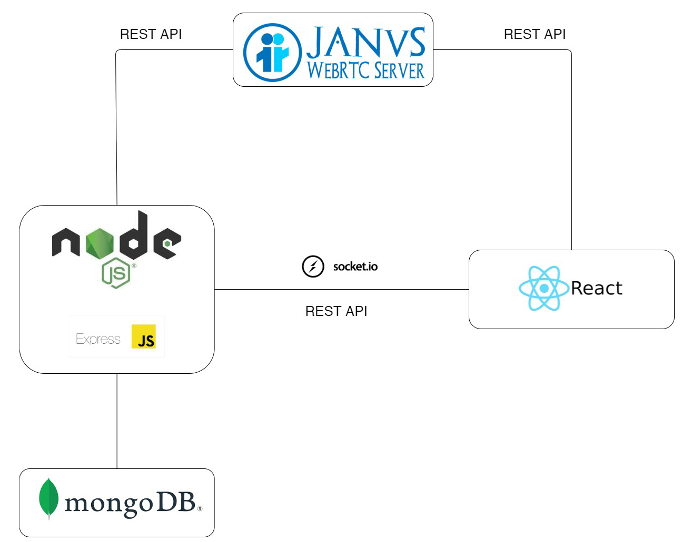

# Cosmos-WebRTC
A WebRTC application built on top of [Janus](https://github.com/meetecho/janus-gateway).
The goal is to provide a **web application** which can manage a queue of users waiting for their turn with the "host" of the _video streaming_.
For example:
- A contact center
- An online front office
- Online Office Hours

## Under the hood

The core of Cosmos is, as we said before, Janus. But under the hood there is a lot more stuff.

As presented in this image there is a **Node.js** backend that communicates with the **React** frontend through some **REST API** and **Socket.io**. They both communicate with Janus, which is deployed elsewhere (the requests from the client are **proxied** by the backend to the correct IP address of the Janus).
We have also a small **MongoDB** to keep track of users. The authentication **needs to be changed** and is developed this way (through **htpOnly cookies** just for demonstration purposes).

Both the frontend and the backend are documented in a more precise way in their respective folders.

## Janus setup
To properly use Cosmos you need to setup Janus the proper way.
In Cosmos we use the **VideoRoom** plugin so you need to enable it and setup the **password** to create Rooms.
You also need to enable the **Admin API** because it is used for the **Stored base authentication mechanism**.
The last thing you need to do is to enable the **Event handler** setting it up just for **plugins**, disabling **grouping** and properly setting the endpoint for the **events**.
That's all. You may find all the information you need on the [official website of Janus](https://janus.conf.meetecho.com)

## Examples

### Let's suppose I run a contact center
The goal in this example is to provide an online contact center to the customers.
Let's suppose that this contact center is open from 8am to 6pm. Only in the working hours the customer can visit the page and use the service (because during the closing hours the employees are home). So:
- The admin can setup the working hours and some other options (well maybe in the future) ==> CREATE A SESSION
- Every employee can provide the same service to every customer ==> HOST A SESSION
- The user can interact with the contact center just clicking a button

So the interesting thing is that the client will be connected to the first employees that becomes free (a human load balancing).

### Let's suppose I am a University teacher
The goal in this example is to provide an ordered online office hours service to the students.
In this case we can totally forgot about the employees because there are just the students and the teacher. For this reason an admin has also the ability to host a session.

## Try it!
If you wanna try it out you can:
- Go to [this link](https://cosmos-webrtc.herokuapp.com) and just try it out
- Make a pull of this repo, setup all the **environment variables** and run it! Be sure you configure Janus the proper way as we explained in the paragraph "**Janus setup**"